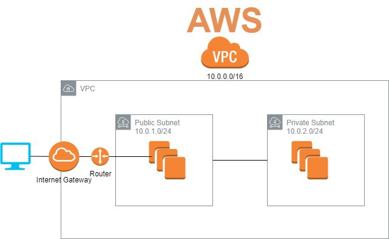

# IAAC using Terraform with AWS as the provider.

## Description

### VPC (Virtual Private Cloud)

### This code will create a simple Vpc with cidr range of 10.0.0.0/16 in both us-east1 and us-west2 region.

### Usage:
- it is used to deploy vpc in multiple region using filestructure deployment.

### prerequisites
- first make sure you have an AWS account. you can use this link to open an account in AWS.
```
https://portal.aws.amazon.com/billing/signup
```
- git locally installed
- terraform locally installed and AWS credentials are being setup for authentication.

### How to use this code?
```
git clone https://github.com/Saintmori/terraform_multi_region_multi_environment_vpc.git
```
- change the directory to vpc_v1 and run terraform commands.
```
cd terraform_multi_region_multi_environment_vpc
cd filestructre
terraform init
terraform plan
terraform apply

```
### contributors
@saintmori

### License
